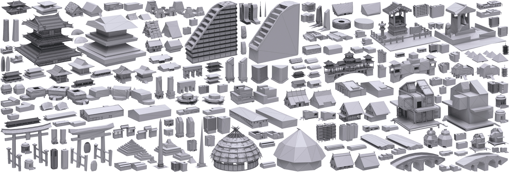

# Low-poly Mesh Generation for Building Models


**Xifeng Gao, Kui Wu, Zherong Pan**

*Lightspeed & Quantum Studios, Tencent America*

Proceedings of SIGGRAPH Conference, 2022

[Paper](Low-poly Mesh Generation for Building Models.pdf)[Video]()[Program]()

```
@inproceedings{Gao:2022:Lowpoly,
  title={Low-poly Mesh Generation for Building Models},
  author={Xifeng Gao and Kui Wu and Zherong Pan},
  booktitle={Proceedings of SIGGRAPH 2022},
  year={2022}
}
```

## News

LowPolyMeshGenerationTool.exe Version 1.0 is to be released! Stay tuned!
**[LowPolyMeshGenerationTool]()**


## License
To be updated.
