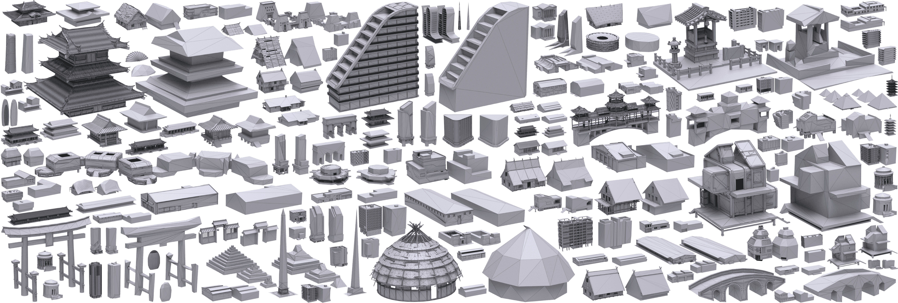

# Low-poly Mesh Generation for Building Models


**Xifeng Gao, Kui Wu, Zherong Pan**

*Lightspeed & Quantum Studios, Tencent America*

Proceedings of SIGGRAPH Conference, 2022

[Paper](paper.pdf) [Video](https://youtu.be/i5rKfvaHX80) [Program](bin.zip)

```
@inproceedings{Gao:2022:Lowpoly,
author = {Gao, Xifeng and Wu, Kui and Pan, Zherong},
title = {Low-Poly Mesh Generation for Building Models},
year = {2022},
isbn = {9781450393379},
publisher = {Association for Computing Machinery},
address = {New York, NY, USA},
url = {https://doi.org/10.1145/3528233.3530716},
doi = {10.1145/3528233.3530716},
abstract = {As a common practice, game modelers manually craft low-poly meshes for given 3D building models in order to achieve the ideal balance between the small element count and the visual similarity. This can take hours and involve tedious trial and error. We propose a novel and simple algorithm to automate this process by converting high-poly 3D building models into both simple and visually preserving low-poly meshes. Our algorithm has three stages: First, a watertight, self-collision-free visual hull is generated via Boolean intersecting 3D extrusions of input’s silhouettes; We then carve out notable but redundant structures from the visual hull via Boolean subtracting 3D primitives derived from parts of the input; Finally, we generate a progressively simplified low-poly mesh sequence from the carved mesh and extract the Pareto front for users to select the desired output. Each stage of our approach is guided by visual metrics, aiming to preserve the visual similarity to the input. We have tested our method on a dataset containing 100 building models with different styles, most of which are used in popular digital games. We highlight the superior robustness and quality by comparing with state-of-the-art competing techniques. Executable program for this paper is at lowpoly-modeling.github.io.},
booktitle = {Special Interest Group on Computer Graphics and Interactive Techniques Conference Proceedings},
articleno = {3},
numpages = {9},
keywords = {mesh simplification, building model, low-poly mesh},
location = {Vancouver, BC, Canada},
series = {SIGGRAPH22 Conference Proceeding}
}
```

## News

LowPolyMeshGenerationTool.exe Version 1.0 is released!
**[LowPolyMeshGenerationTool](bin.zip)**


## License
To be updated.
